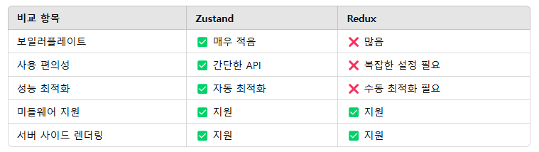

# 250205 강의

## zustand
- React 어플리케이션에서 전역 관리를 쉽게 할 수 있도록 도와주는 **경량 상태 관리** 라이브러리
- Redux처럼 복잡한 개념이 없는 게 단점!
- 단순 JavaScript 함수만으로 상태 정의 가능
- 설치 방법 : npm install zustand

- 사용 예제 코드
```
import { create } from 'zustand';

const useStore = create((set) => ({
  count: 0,
  increase: () => set((state) => ({ count: state.count + 1 })),
  decrease: () => set((state) => ({ count: state.count - 1 })),
}));

function Counter() {
  const { count, increase, decrease } = useStore();
  return (
    <div>
      <h1>{count}</h1>
      <button onClick={increase}>+</button>
      <button onClick={decrease}>-</button>
    </div>
  );
}

export default Counter;
```

## Zustand와 Redux의 비교
